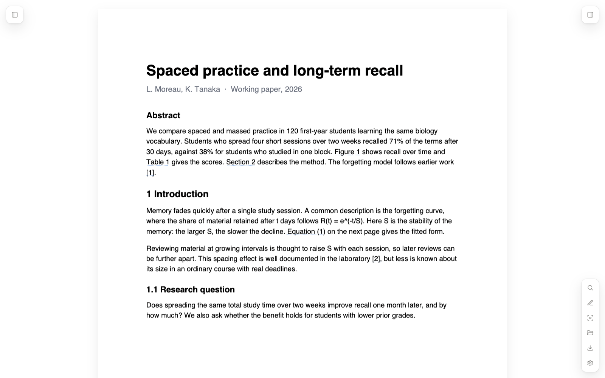
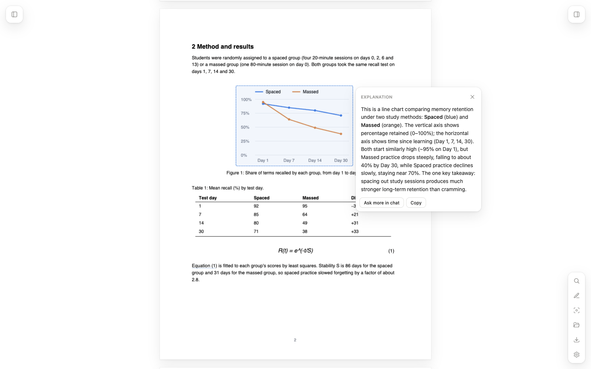
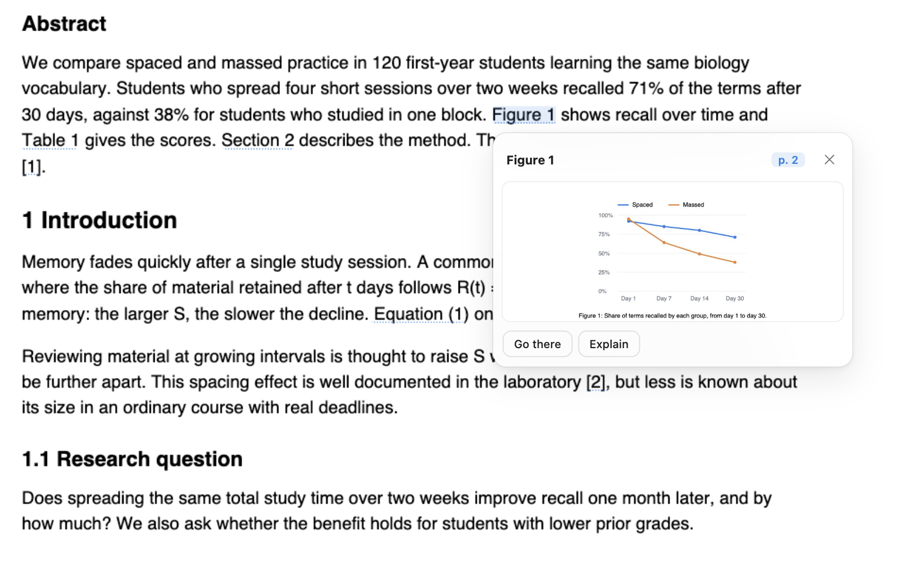
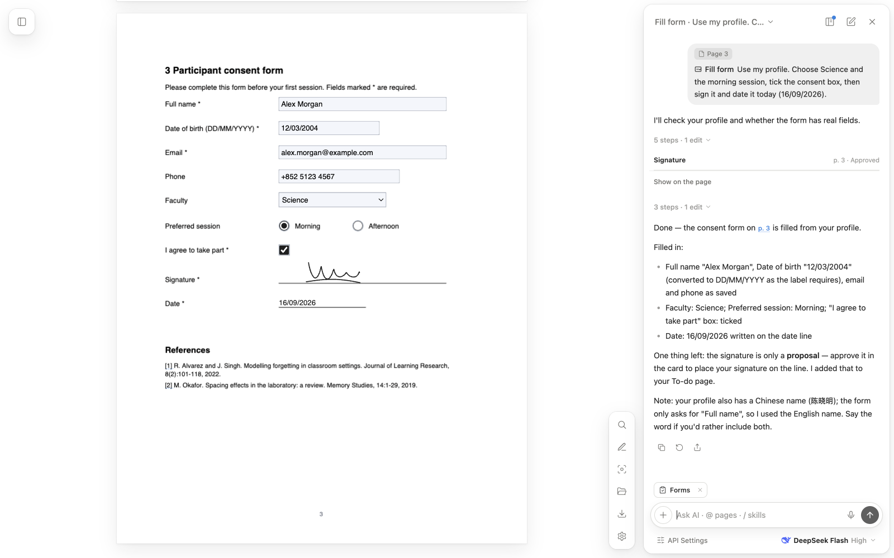
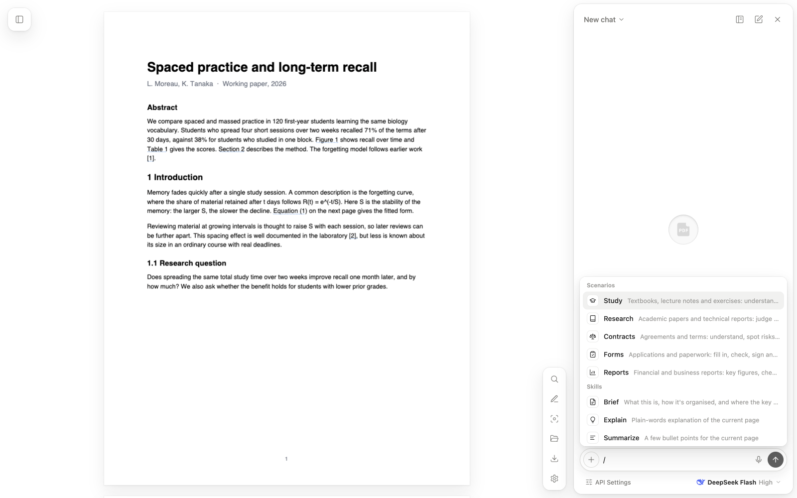
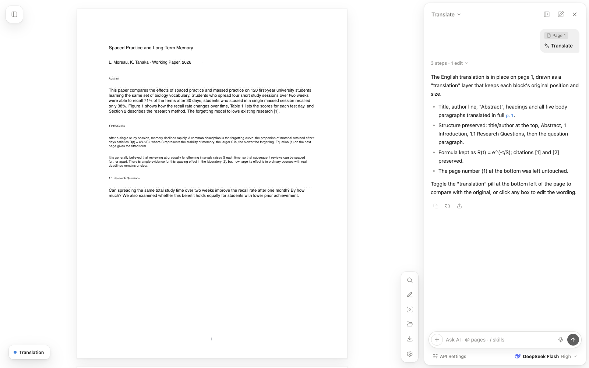
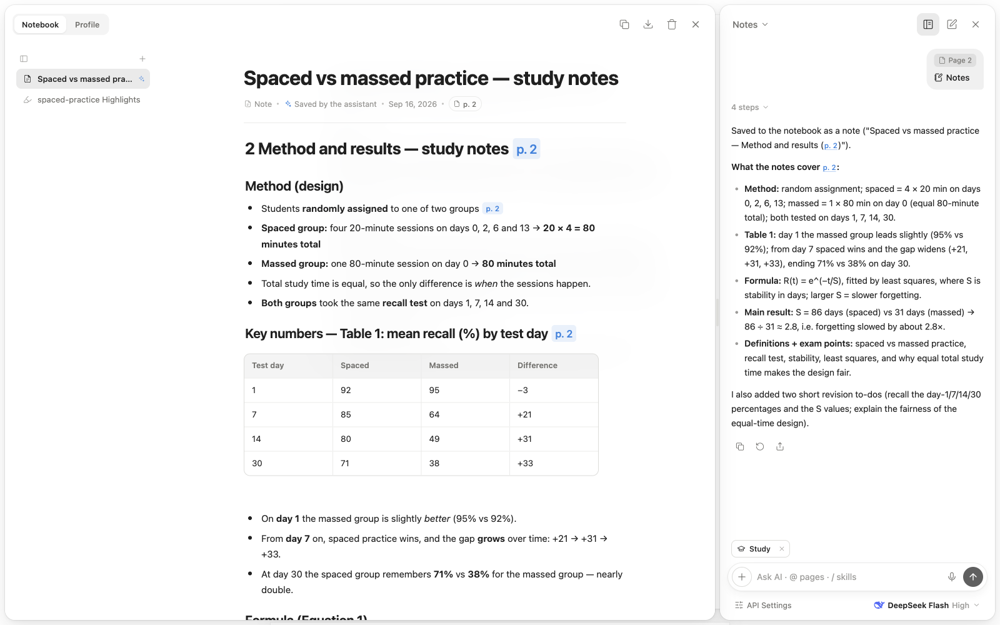

<div align="center">


# PaperLens

**A PDF reader for Chrome with an AI agent that works on the page with you.**

English · [简体中文](README.zh-CN.md)

</div>



## Contents

- [Introduction](#introduction)
- [Highlights](#highlights)
  - [1. Hold Option to explain anything](#1-hold-option-to-explain-anything)
  - [2. Figures and references where they're mentioned](#2-figures-and-references-where-theyre-mentioned)
  - [3. An agent that can work on the PDF](#3-an-agent-that-can-work-on-the-pdf)
  - [4. Scenarios](#4-scenarios)
  - [5. Translate in place](#5-translate-in-place)
  - [6. A notebook beside every document](#6-a-notebook-beside-every-document)
- [More features](#more-features)
- [Install](#install)
- [Privacy](#privacy)
- [Built with](#built-with)
- [License](#license)

## Introduction

PaperLens opens web and local PDFs in its own viewer: a clean reader with markup, search and live form fields, plus an AI assistant that sits beside the page.

The assistant doesn't just answer questions about the PDF. It can look at pages, search the document and the web, fill in forms, highlight and annotate, translate a page in place, and save notes to a notebook for that document. You pick a **scenario** — study, research, contracts, forms or reports — and it leans on the skills that fit.

There's no PaperLens account and no build step. Load the folder into Chrome and add your own DeepSeek key, or point it at any OpenAI-compatible endpoint. The interface is available in English and Chinese.

## Highlights

### 1. Hold Option to explain anything

Hold **⌥ Option** (**Alt** on Windows) and point at a paragraph, formula, table or chart. PaperLens outlines the region under the pointer, sends just that crop to the model, and shows a short explanation in a bubble on the page.

- No screenshots, no copying, no describing where you're looking.
- Only the crop is sent, so it's quick and cheap.
- **Ask more in chat** carries the region into the conversation for follow-up questions.



### 2. Figures and references where they're mentioned

References in the text become clickable: **Figure 2**, **Table 3**, **Section 4.1**, **Eq. (5)** and citations like **[12]**. Click one and a card opens beside the sentence you're reading, showing the figure or table cropped from its page, the section text, or the reference entry.

- Works straight from the PDF — no AI call.
- **Go there** jumps to the original; **Explain** asks the assistant about it.



### 3. An agent that can work on the PDF

The assistant runs as an agent with real tools. It decides which pages to look at, works in steps, and checks its own work. Each step appears in the reply as a collapsible timeline, and every change to the PDF can be undone.

| It can… | Tools |
| --- | --- |
| **Read the document** | View pages, zoom into a region, search the whole text, read page layout, find exact text boxes, read the contents |
| **Search the web** | Web search (Tavily, Bing or DuckDuckGo) and read a result page as clean text |
| **Mark up the PDF** | Highlight text, add text boxes, draw shapes and tick marks, add a translation layer, list and delete markup |
| **Work with forms** | List and fill real form fields, propose a signature, propose redactions |
| **Write to your workspace** | Save notes to the notebook, add actions to its To-do page, read and save your profile (only after you agree) |
| **Do the practical bits** | Calculate instead of guessing, build a checklist of findings, export deadlines to your calendar (`.ics`), set the sidebar contents |

Skills are ready-made tasks that put these tools together. Type `/` in the composer to pick one. A few that show what the agent can do:

| Skill | What happens |
| --- | --- |
| **Fill form** | Reads your saved profile, fills the real fields, and asks only for what's missing |
| **Sign** | Finds the signature and date lines, proposes your saved signature and adds today's date |
| **Review form** | Checks for empty required fields, wrong date formats, missing signatures and contradictory ticks |
| **Find citation** | Looks up a cited work in the reference list, finds it online, and returns a BibTeX entry |
| **Highlights** | Collects your highlights by topic into notes, with page links, quiz questions and flashcards |
| **Risk check** | Reads every page of a contract, ranks risky clauses, and adds the serious ones to your to-dos |
| **Deadlines** | Pulls out dates and notice periods as to-dos and exports them to your calendar |
| **Redact** | Proposes black boxes over names, ID numbers, contacts and signatures for you to approve |

The full list is under [More features](#all-skills).



### 4. Scenarios

A scenario tells the assistant what kind of work you're doing. Pick one from the top of the `/` menu and it stays with that chat.

Each scenario adds its own guidance to the system prompt and a set of **preferred skills**. The assistant picks among those by itself — you don't have to name them — and they appear as shortcuts above the composer. Every other skill and tool stays available.

| Scenario | For | Preferred skills | How the assistant behaves |
| --- | --- | --- | --- |
| **Study** | Textbooks, lecture notes, exercises | Explain, Notes, Flashcards, Quiz, Step by step, Revision plan, Glossary | Explains step by step in plain words, checks understanding with questions, saves study material to the notebook, adds revision tasks |
| **Research** | Papers and technical reports | Paper card, Critique, Find citation, Brief, Glossary | Separates what the authors claim from what the evidence shows, keeps exact numbers with pages, searches the web for cited work |
| **Contracts** | Agreements and terms | Risk check, Plain terms, Deadlines, Suggest changes, Key facts, Redact | Quotes exact wording with its page, flags risky terms as a checklist, puts obligations and deadlines on the to-do list, suggests a lawyer for serious issues |
| **Forms** | Applications and paperwork | Fill form, Review form, Documents needed, Sign, Redact | Reads your profile before asking for personal details, asks before saving anything new, lists documents to prepare |
| **Reports** | Financial and business reports | Key figures, Check numbers, One-page summary, CSV, Key facts | Quotes figures with unit, period and page, uses the calculator for every sum and percentage, explains charts by trend and outliers |



### 5. Translate in place

The **Translate** skill reads the page layout and lays the translation over the original, block by block, as a separate layer. Headings, paragraphs and positions stay where they were, so you read the translated page rather than a wall of text in the chat.

- Switch the layer on and off from the page; edit or delete it like any markup.
- Hidden layers are left out when you download the PDF.



### 6. A notebook beside every document

Open the workspace next to the chat and each PDF gets its own notebook. The assistant saves notes, glossaries, flashcards, quizzes, paper cards, key-figure tables and plans there instead of leaving them in the chat history.

- **Edit in place** with a block editor: `/` for blocks, Markdown shortcuts, a format bar, tables, flashcards and clickable page citations.
- **Organise** pages into folders and drag to reorder. Copy a page as Markdown or export the notebook.
- **To-do page**: actions the assistant finds (deadlines, documents to prepare, revision tasks) land as checkboxes on the notebook's To-do page, each linked to its page. Tick, edit or reorder them like any other block.
- **Profile** keeps your details for forms in groups: name, basic information, identity documents, contact and other details. Add fields to any group, rename them ("ID card number" → "Hong Kong ID"), or add groups of your own such as School. It's stored locally, and the assistant only saves to it after you say yes.
- **Private details.** Close the eye on any detail to make it private. It's hidden on screen, and the assistant never sees it: it gets a placeholder like `{{profile:idNumber}}` and passes it back when filling a form, and PaperLens puts the real value in locally. ID and passport numbers start private.



## More features

### All skills

| Group | Skills |
| --- | --- |
| **Read and understand** | Brief · Explain · Summarize · Define · Contents · Translate |
| **Study** | Highlights · Notes · Quiz · Glossary · Flashcards · Step by step · Revision plan |
| **Research** | Paper card · Critique · Find citation |
| **Contracts** | Risk check · Plain terms · Suggest changes · Deadlines · Key facts |
| **Forms** | Fill form · Review form · Documents needed · Sign · Redact |
| **Reports** | Key figures · Check numbers · One-page summary · CSV |

### Reader and tools

| Area | What's included |
| --- | --- |
| **Opening PDFs** | PDF links open in PaperLens automatically; local files can be opened or dropped onto the window |
| **Navigation** | Thumbnails, PDF bookmarks, AI-built contents for PDFs without bookmarks, go to page, clickable links |
| **Zoom** | Fit width, fit page and smooth zoom with the trackpad or Ctrl + scroll |
| **Search** | Search the whole document with every match highlighted |
| **Selection menu** | Highlight, underline, strike through, copy, explain, translate or ask about selected text |
| **Markup** | Pen, highlighter, underline, strike-through, rectangles, ellipses, lines, arrows and text boxes in any colour and width |
| **Forms and signatures** | Real form fields you can type into; draw and save a signature |
| **Chat context** | Attach `@3` or `@2-4` for pages, selected text, or a region you draw |
| **Chat** | Multiple saved chats, page citations you can click, retry, copy, share and dictation |
| **Export** | Annotated PDF, image-only redacted PDF, Markdown notes, flashcards as TSV, tables as CSV, BibTeX and `.ics` calendars |
| **Settings** | English or Chinese, light or dark, model and thinking level, document edits and web search on or off |

## Install

PaperLens isn't on the Chrome Web Store yet. Load it as an unpacked extension:

1. Download or clone this repository.

   ```bash
   git clone https://github.com/caichinghang/paperlens.git
   ```

2. Open `chrome://extensions` in Chrome.
3. Turn on **Developer mode** in the top-right corner.
4. Click **Load unpacked** and choose the repository folder.
5. Open any PDF link, or click the PaperLens icon in the toolbar and open a local file.

### Connect the assistant

Open the assistant and click **API Settings**.

| Setting | Default | Notes |
| --- | --- | --- |
| API key | — | Get one from [DeepSeek](https://platform.deepseek.com) |
| Base URL | `https://api.deepseek.com` | Any OpenAI-compatible endpoint works |
| Model | `deepseek-flash` | Use a model with tool calling for agent features |
| Page format | Auto | Choose **Text only** for models that can't read images |
| Thinking | High | Off, Low, High or Max |
| Document edits | On | Turn off to stop the assistant changing the PDF |
| Web search | On | Add a Tavily key for better results; otherwise Bing, then DuckDuckGo |

To update, pull the latest code and click **Reload** on the PaperLens card in `chrome://extensions`.

## Privacy

- **No account, no analytics.** PaperLens has no server of its own.
- **Stored locally.** API keys, chats, notebooks, profile, markup, form values, signatures and settings stay in Chrome's extension storage.
- **Only what's needed is sent.** Each request sends the messages and the page text or images for that request to the AI provider you set. Option explanations send only the cropped region.
- **Web search is visible.** Search queries go to Tavily, Bing or DuckDuckGo, and a result page may be fetched to read it. You can turn web search off.
- **Private details stay on your machine.** A detail with a closed eye never goes to the AI provider. The assistant fills forms with a placeholder, and anything on its way out (tool results, page images, messages, even a number you paste into the chat) has private values swapped back to their placeholder. Only values saved in your profile are covered: if a PDF already has your ID number printed in it, page images still show it.
- **Your profile is yours.** The assistant asks before saving personal details, and you can edit or clear them at any time.
- **Redactions are real.** A redacted download is flattened to images so the covered text is removed, not just hidden.

## Built with

PaperLens is plain HTML, CSS and JavaScript modules. There's no framework, no bundler and no `npm install`.

| Layer | What it uses |
| --- | --- |
| **Extension** | Chrome Manifest V3. A service worker (`background.js`) and content script send PDF links to `viewer.html` |
| **PDF engine** | [PDF.js](https://mozilla.github.io/pdf.js/), vendored in `vendor/pdfjs`, for rendering, the text layer, form fields and saving annotations |
| **AI** | Any OpenAI-compatible Chat Completions API with function calling, streamed; DeepSeek by default |
| **Agent** | A step loop in `ai.js` over the tools in `agent-tools.js`. Skills and scenarios are prompts layered onto the system prompt |
| **Storage** | `chrome.storage.local`, falling back to `localStorage` outside the extension |

<details>
<summary>Source map</summary>

| File | Responsibility |
| --- | --- |
| `src/viewer.js` | Viewer shell: loading, rendering, navigation, zoom, search, download |
| `src/ai.js` | Assistant panel, chats, skills, scenarios, Markdown rendering, agent loop |
| `src/agent-tools.js` | Tool definitions and handlers the model can call |
| `src/lens.js` | Hold-Option region detection and explanation bubble |
| `src/references.js` | Figure, table, section, equation and citation pop-out cards |
| `src/markup.js` | Drawing, highlights, text boxes, layers, signatures, PDF export |
| `src/annotation-history.js` | Page-scoped markup snapshots for efficient undo and redo |
| `src/workspace.js` | Notebook (including the To-do page) and profile panel |
| `src/editor.js`, `src/blocks.js` | Block editor for notebook pages and Markdown conversion |
| `src/profile.js`, `src/todos.js` | Profile groups and fields; to-do items on the notebook's To-do page |
| `src/privacy.js` | Placeholders for private profile details, and masking them out of what goes to the AI |
| `src/web.js` | Web search and readable-page extraction |
| `src/sse.js` | Robust parsing of streamed assistant responses |
| `src/rules.js` | Blank lines on a page, so dates and signatures sit on them |
| `src/pdf-writer.js`, `src/ics.js` | Image-only PDF for redactions; calendar export |
| `src/i18n.js` | English and Chinese interface strings |

</details>

Run the tests with Node:

```bash
node --test tests/*.mjs
```

The screenshots use the demo papers in `docs/samples/` (English and Chinese), built by `python3 docs/make-samples.py`.

## License

PaperLens is released under the [MIT License](LICENSE). PDF.js is licensed under Apache 2.0.
