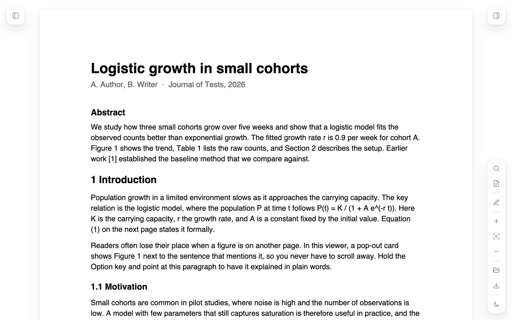
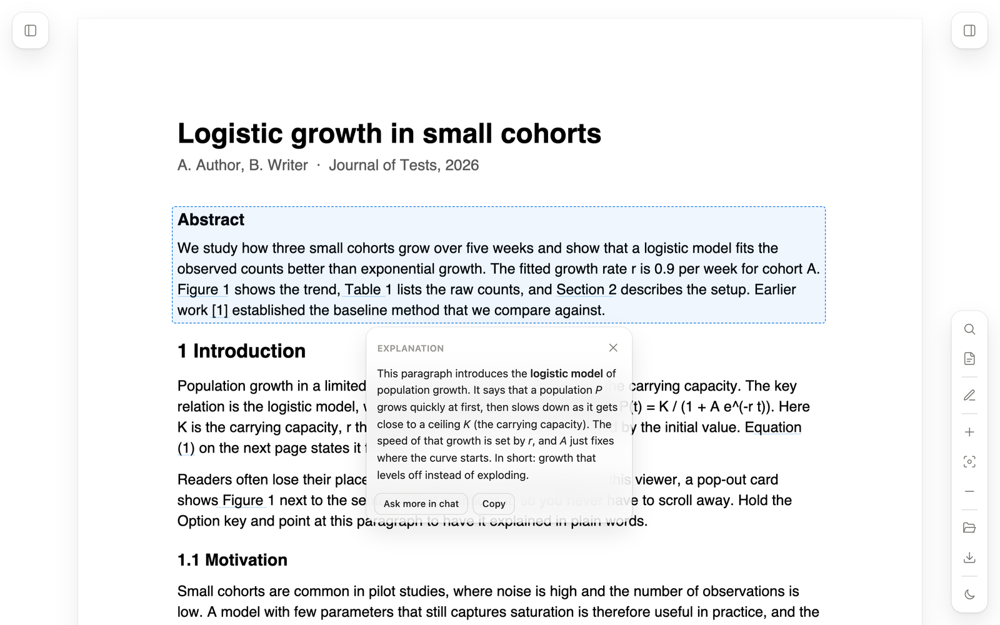
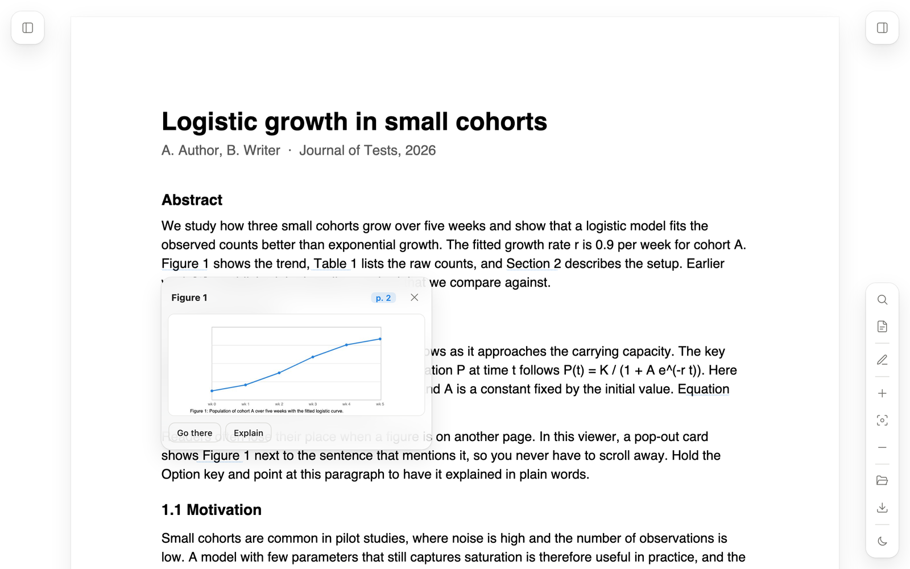
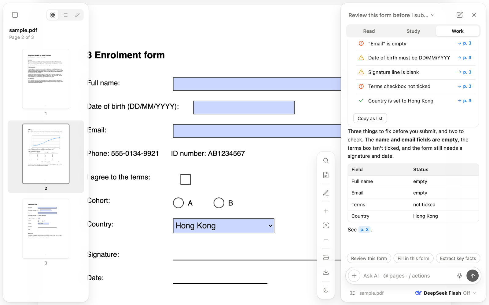
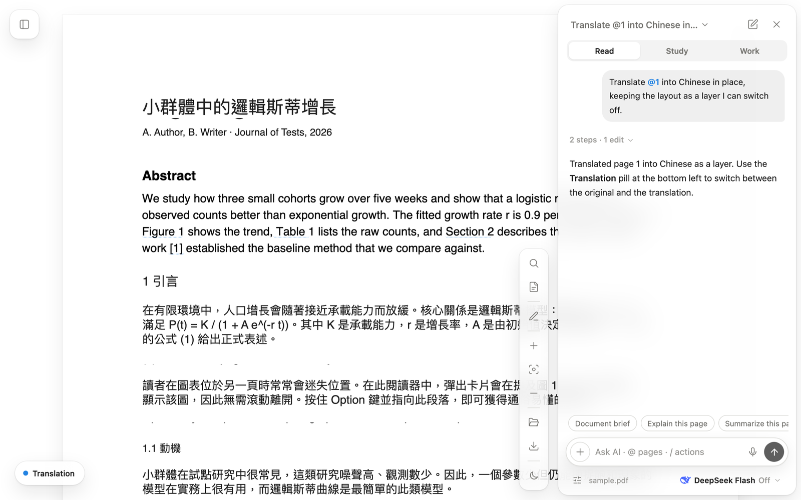
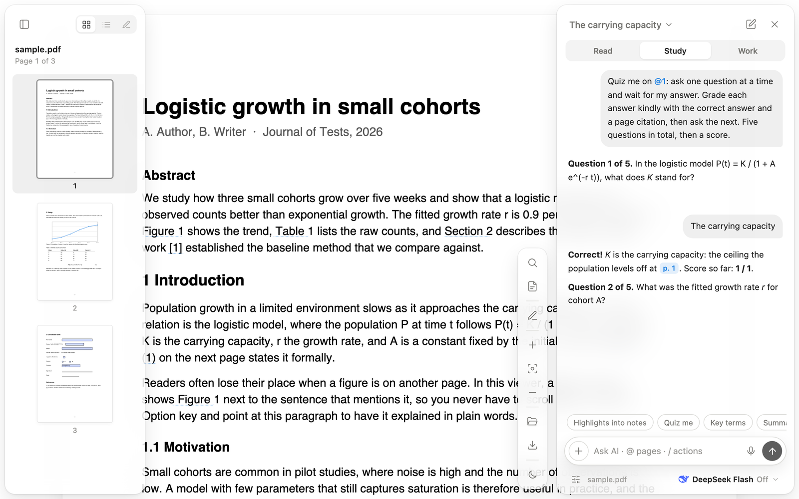
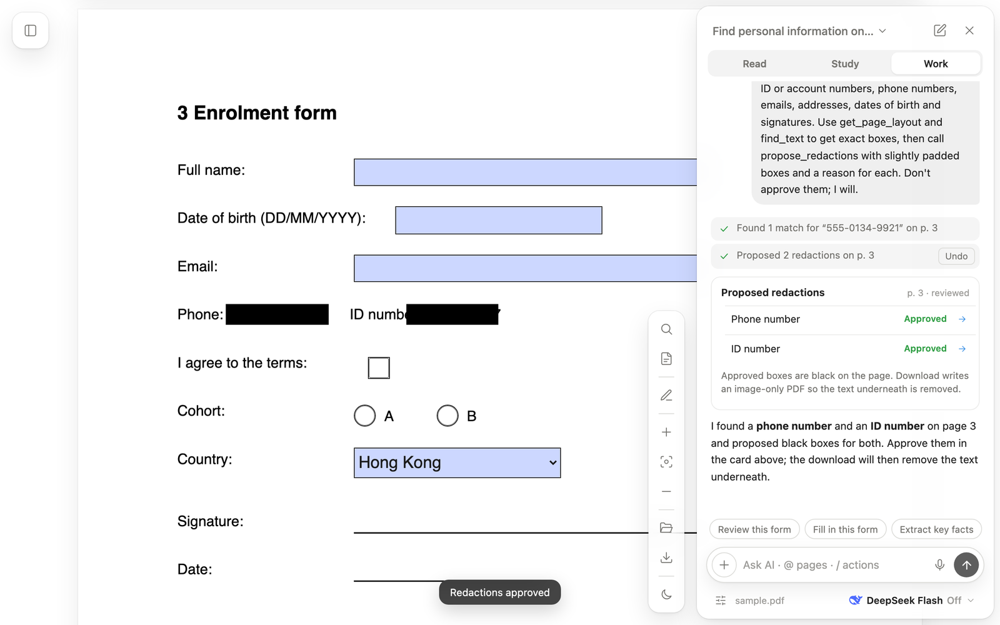
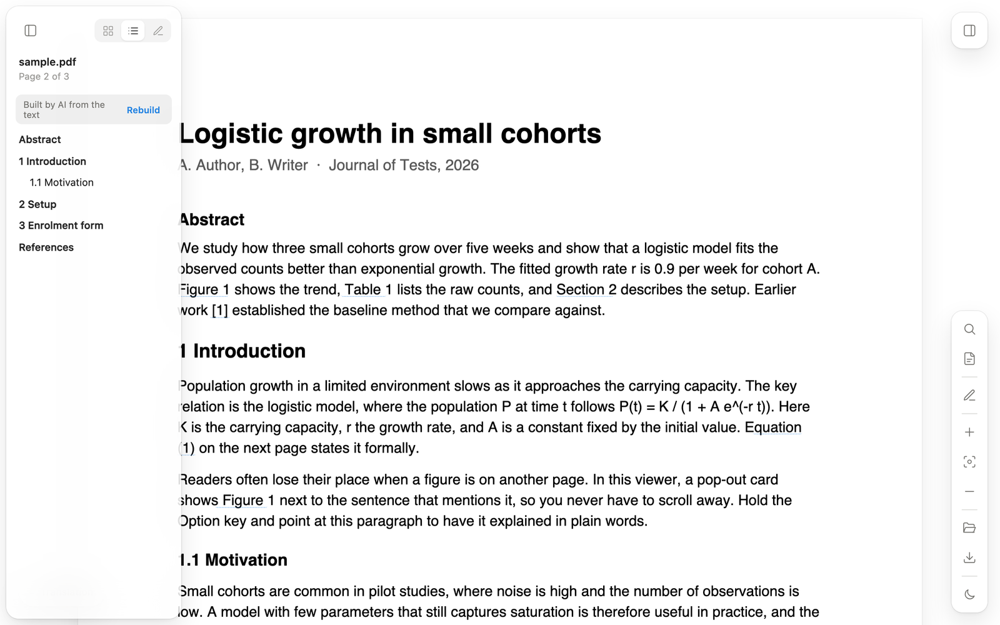

# PaperLens

A calm PDF reader for Chrome with an AI that can read the page with you, explain what you point at, fill in forms, translate in place, quiz you, and edit the document, all without leaving the tab.

No build step, no account. Bring a [DeepSeek](https://platform.deepseek.com) API key (or any OpenAI-compatible endpoint) and load the folder as an unpacked extension.

## Why it's different

Most PDF tools with an AI bolt a chatbot onto the side. PaperLens puts the AI on the page.

### Point at anything, get it explained

Hold **⌥ Option** and move the pointer over a formula, chart, table or dense paragraph. The area lights up, and after a moment a small bubble explains just that part in plain words. It sends a crop of the region rather than the whole page, so it's fast and cheap. **Ask more in chat** carries the region into the conversation.

### References that pop out

"See Figure 2", "Table 3", "Section 4.1", "Eq. (5)" and "[12]" become clickable. A floating card shows the figure crop, the table, the section text or the reference entry right where you are, so you never lose your place. No AI call needed for this one.

### The AI edits the PDF, and you can edit what it did

The assistant works in steps with real tools. It can open pages, zoom into regions, search the whole document, fill real form fields, add text boxes, highlight, draw tick marks, and check its own work. Every step shows up in the reply with an **Undo** button.

Form fields are live inputs, so you can type into them yourself or fix what the AI typed. Any text box the AI adds can be clicked, edited, moved or recoloured.

**Review this form** checks a form before you submit it: empty required fields, wrong date formats, missing signatures and contradictory ticks, each with a jump link to the spot.

### Translate in place

Translation goes over the page as a layer that keeps the original layout. A pill at the bottom left switches it on and off, and hidden layers are left out of the download.

### Study with it

Study skills turn the document and your own highlights into notes, key-term tables, flashcards (with Anki export) and quizzes that ask one question at a time and grade your answers with page citations.

### Redact before sharing

Ask it to find personal information. It proposes boxes you approve one by one or all at once. Approved boxes turn black, and the download writes an image-only PDF so the text underneath is really gone, not just covered.

### Skills

Type `/` in the composer to pick a skill: brief, explain, quiz, flashcards, key facts, redact and more, each with a one-line description. The skill appears as a chip above the composer next to any attached pages; add details if you like and send.

If a PDF has no table of contents, the outline tab offers **Ask AI to build one** and fills the sidebar from the headings.

## Everything else

| Area | What you get |
| --- | --- |
| Opening | Web PDFs open in the viewer automatically; drop a local file anywhere, or use the folder button |
| Reading | Smooth zoom (pinch, ⌘ scroll, fit width / page), thumbnails, table of contents, clickable links, light and dark themes, resizable panels |
| Search | ⌘F with every match highlighted, Enter / Shift-Enter to step through |
| Markup | Highlight, underline, strikethrough, pen, shapes, arrows, text boxes, a reusable signature, undo / redo. Saved per document and written into the PDF on download as standard annotations |
| Selection menu | Select text for Highlight, Underline, Strike, Copy, Explain, Translate and Ask AI |
| Chat | Attach pages with `@3` or `@2-4`, quote a passage, dictate with the mic, click any `p. 3` citation to jump. One continuous history across documents and reloads |
| Export | Download writes markup and form values into the PDF; flashcards export as TSV, tables as CSV |

## Install

1. Download or clone this repository.
2. Open `chrome://extensions` and turn on **Developer mode** (top right).
3. Click **Load unpacked** and choose the repository folder.
4. Open any PDF link, or click the extension icon to open the viewer and drop a file in.

To use the AI:

1. Open the assistant with the button at the top right of the viewer.
2. Click **Add your DeepSeek API key**, paste a key from [platform.deepseek.com](https://platform.deepseek.com), and save.
3. The default model is `deepseek-flash`, which reads page images and uses tools. Any OpenAI-compatible model works: set the base URL and model ID in Settings, and choose **Text only** under "Send pages as" for models that can't read images.

After changing the code, click **Reload** on the extension's card in `chrome://extensions`.

## Privacy

The API key stays in your browser's extension storage and is only sent to the base URL you configure. Your messages, the pages you attach (as images or text) and hover-explain crops go to that API. Nothing else leaves the browser. Markup, form values and chat history are stored locally.

## Limitations

- Password-protected PDFs aren't supported yet.
- Scanned PDFs without a text layer can't be searched, and the AI can't read them (no OCR).
- Redacted downloads are image-only (150 dpi) by design, so their text can't be selected.
- Reference pop-outs and the explain lens find figures and paragraphs with simple layout rules; unusual layouts can pick the wrong area. Use **Go there** or attach the page instead.

## Built with

[PDF.js](https://mozilla.github.io/pdf.js/) (vendored, Apache 2.0) for rendering, text, forms and annotation writing. Everything else is plain HTML, CSS and JavaScript modules with no dependencies.

## License

MIT
