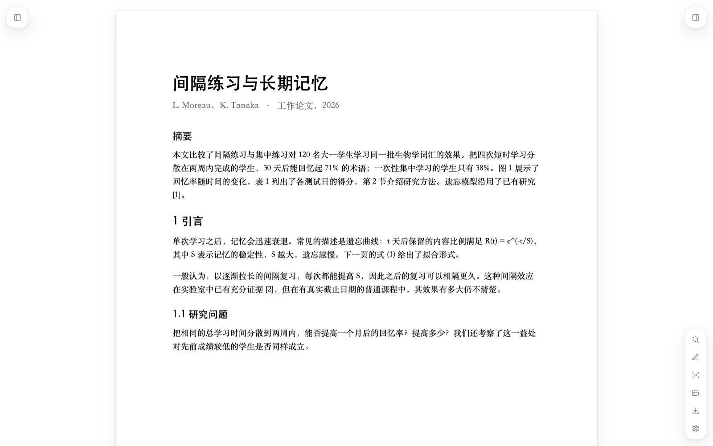
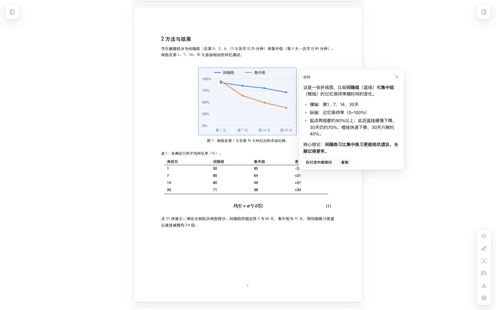
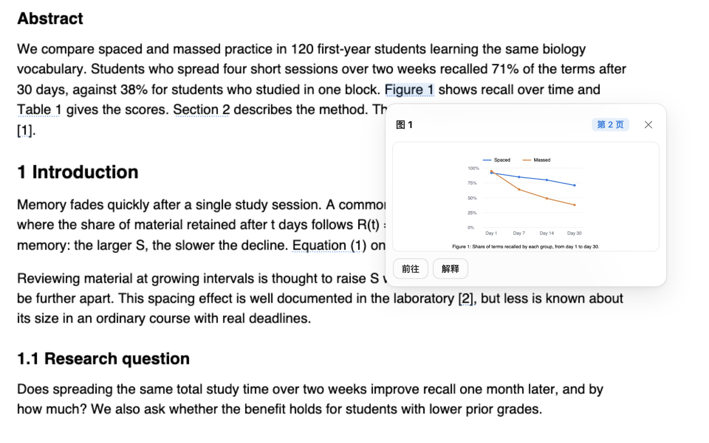
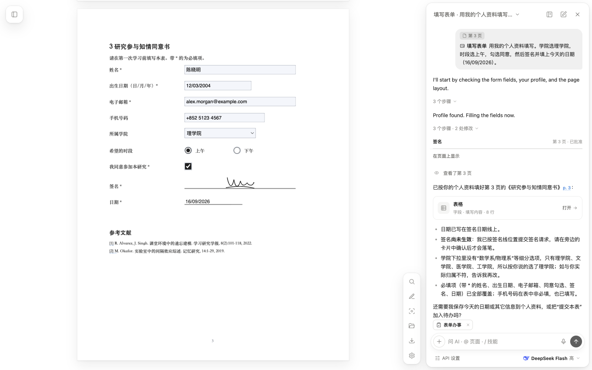
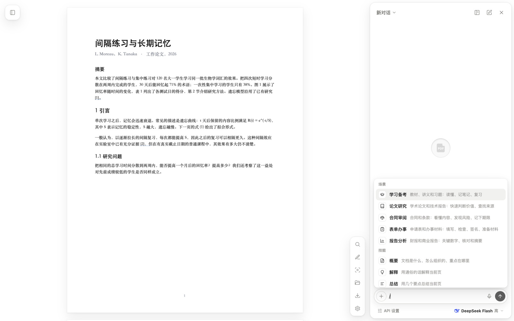
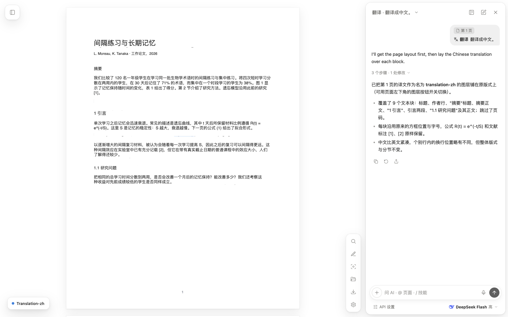
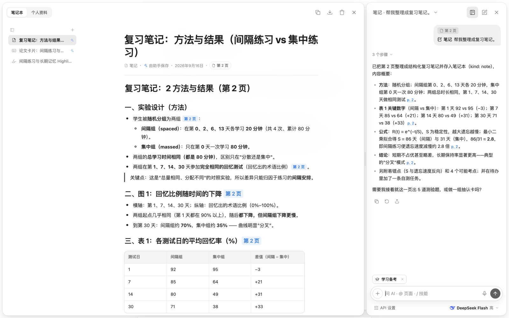

<div align="center">


# PaperLens

**一个 Chrome 上的 PDF 阅读器，内置能直接在页面上帮你干活的 AI Agent。**

[English](README.md) · 简体中文

</div>



## 目录

- [简介](#简介)
- [核心功能](#核心功能)
  - [1. 按住 Option，指哪解释哪](#1-按住-option指哪解释哪)
  - [2. 图表和引用，就地预览](#2-图表和引用就地预览)
  - [3. 能直接操作 PDF 的 Agent](#3-能直接操作-pdf-的-agent)
  - [4. 场景](#4-场景)
  - [5. 原地翻译](#5-原地翻译)
  - [6. 每份文档都有自己的笔记本](#6-每份文档都有自己的笔记本)
- [更多功能](#更多功能)
- [安装](#安装)
- [隐私](#隐私)
- [性能](#性能)
- [技术架构](#技术架构)
- [许可证](#许可证)

## 简介

PaperLens 会用自己的阅读器打开网页上和本地的 PDF：界面简洁，支持批注、搜索和可直接填写的表单，旁边还有一个 AI 助手。

这个助手不只是回答关于 PDF 的问题。它可以查看页面、搜索文档和网络、填写表单、高亮和批注、原地翻译整页，并把笔记存到这份文档专属的笔记本里。你可以选择一个**场景**——学习备考、论文研究、合同审阅、表单办事或报告分析——它会优先使用适合的技能。

不需要 PaperLens 账号，也不需要构建。把文件夹加载进 Chrome，填入你自己的 DeepSeek API Key，或者接入任何 OpenAI 兼容的接口即可。界面支持中文和英文。

## 核心功能

### 1. 按住 Option，指哪解释哪

按住 **⌥ Option**（Windows 上为 **Alt**），把鼠标移到一段文字、公式、表格或图表上。PaperLens 会框出指针下的区域，只把这块截图发给模型，然后在页面上的小气泡里给出简短解释。

- 不用截图、不用复制，也不用描述你在看哪里。
- 只发送裁剪区域，速度快、花费低。
- 点 **在对话中继续问**，可以带着这块区域到对话里追问。



### 2. 图表和引用，就地预览

正文里的引用会变成可点击的链接：**Figure 2**、**Table 3**、**Section 4.1**、**Eq. (5)**，以及 **[12]** 这样的参考文献编号。点一下，就会在你正在读的句子旁边弹出卡片，显示从原页面裁下的图或表、章节内容或参考文献条目。目前识别的是英文写法，适合阅读英文论文。

- 直接从 PDF 里读取，不需要调用 AI。
- **前往** 跳到原位置；**解释** 让助手讲解这张图表。



### 3. 能直接操作 PDF 的 Agent

助手是一个带真实工具的 Agent。它会自己决定看哪些页，分步骤完成任务，并检查自己的结果。每一步都以可折叠的时间线显示在回复里，对 PDF 的每一处修改都可以撤销。

| 它能… | 工具 |
| --- | --- |
| **阅读文档** | 查看页面、放大局部区域、全文搜索、读取页面版式、定位文字的精确位置、读取目录 |
| **联网搜索** | 搜索网页，时事问题优先搜索最新新闻；把搜索结果或你贴出的链接读取为纯文本，回复下方列出来源 |
| **批注 PDF** | 高亮文字、添加文本框、画图形和勾选标记、添加翻译图层、列出和删除批注 |
| **处理表单** | 列出并填写真实的表单字段、放置签名、建议涂黑区域 |
| **写入工作区** | 把笔记存进笔记本、往笔记本的待办页添加事项、读取和保存个人资料（需你同意后才保存） |
| **处理实际事务** | 用计算器算数而不是估算、把发现整理成清单、把截止日期导出到日历（`.ics`）、生成侧栏目录 |

技能是把这些工具组合好的现成任务，在输入框里输入 `/` 即可选择。几个能体现 Agent 能力的例子：

| 技能 | 效果 |
| --- | --- |
| **填写表单** | 读取你保存的个人资料，填写真实字段，只询问缺少的信息 |
| **签名** | 找到签名和日期的位置，放上你保存的签名，并填入今天的日期 |
| **检查表单** | 检查必填项是否为空、日期格式是否正确、是否漏签、勾选是否互相矛盾 |
| **引用查找** | 在参考文献列表里找到被引用的文献，上网查到正式版本，并给出 BibTeX |
| **高亮笔记** | 把你的高亮按主题整理成笔记，附页码链接、测验题和抽认卡 |
| **风险条款** | 逐页阅读合同，按严重程度列出风险条款，并把严重的加入待办 |
| **截止日期** | 把日期和通知期限整理成待办，并导出到日历 |
| **涂黑** | 在姓名、证件号、联系方式和签名上建议涂黑框，由你确认 |

完整列表见 [更多功能](#全部技能)。



### 4. 场景

场景告诉助手你在做哪一类工作。在 `/` 菜单顶部选择一个，它会在整个对话中保持生效。

每个场景都会在系统提示词中加入自己的指引，并设定一组**优先技能**。助手会自己从中挑选合适的技能，不需要你点名；这些技能也会作为快捷按钮显示在输入框上方。其他技能和工具仍然可以使用。

| 场景 | 适用于 | 优先技能 | 助手的做法 |
| --- | --- | --- | --- |
| **学习备考** | 教材、课堂笔记、习题 | 解释、笔记、抽认卡、测验、分步讲题、复习计划、术语表 | 用平实的语言一步步讲解，用提问检查理解，把学习资料存进笔记本，添加复习任务 |
| **论文研究** | 学术论文、技术报告 | 论文速读卡、批判性阅读、引用查找、概要、术语表 | 区分作者的主张和证据实际说明了什么，保留准确数字和页码，联网查找被引用的文献 |
| **合同审阅** | 协议和条款 | 风险条款、白话解读、截止日期、修改意见、关键信息、涂黑 | 引用原文并标明页码，把风险条款列成清单，把义务和截止日期加入待办，严重问题建议咨询律师 |
| **表单办事** | 申请表和各类文书 | 填写表单、检查表单、材料清单、签名、涂黑 | 先读取个人资料再询问个人信息，保存新信息前先征求同意，列出需要准备的材料 |
| **报告分析** | 财务和商业报告 | 关键指标、核对数字、一页摘要、表格转 CSV、关键信息 | 引用数字时注明单位、期间和页码，所有加减和百分比都用计算器，按趋势和异常值解读图表 |



### 5. 原地翻译

**翻译** 技能会读取页面版式，把译文按文本块逐块覆盖在原文上，作为一个独立图层。标题、段落和位置都保持不变，你读到的是翻译后的页面，而不是对话框里的一大段文字。

- 可以在页面上随时开关图层，也可以像普通批注一样编辑或删除。
- 下载 PDF 时，隐藏的图层不会被导出。



### 6. 每份文档都有自己的笔记本

在对话旁边打开工作区，每个 PDF 都有自己的笔记本。助手会把笔记、术语表、抽认卡、测验、论文速读卡、指标表格和计划存在这里，而不是留在聊天记录里。

- **原地编辑**：块编辑器支持 `/` 插入块、Markdown 快捷输入、格式工具栏、表格、抽认卡和可点击的页码引用。
- **整理**：用文件夹管理页面，拖动即可排序。可以把页面复制为 Markdown，或导出整个笔记本。
- **待办页**：助手发现的事项（截止日期、要准备的材料、复习任务）会以勾选框的形式加到笔记本的「待办」页，每项都关联到对应页码，可以像其他块一样勾选、编辑和拖动排序。
- **个人资料**：按分组保存填表常用的信息——姓名、基本信息、证件、联系方式和其他信息。每个分组都能添加字段、修改字段名（比如把「ID card number」改成「Hong Kong ID」），也可以自建分组，比如「学校」。数据只存在本地，助手只有在你同意后才会写入。
- **隐私资料**：把任一项资料的眼睛关上就设为隐私。它在界面上会被隐藏，AI 也永远看不到：AI 只拿到类似 `{{profile:idNumber}}` 的占位符，填表时原样传回，由 PaperLens 在本地换成真实内容。身份证和护照号码默认为隐私。



## 更多功能

### 全部技能

| 分组 | 技能 |
| --- | --- |
| **阅读理解** | 概要 · 解释 · 总结 · 释义 · 目录 · 翻译 |
| **学习** | 高亮笔记 · 笔记 · 测验 · 术语表 · 抽认卡 · 分步讲题 · 复习计划 |
| **研究** | 论文速读卡 · 批判性阅读 · 引用查找 |
| **合同** | 风险条款 · 白话解读 · 修改意见 · 截止日期 · 关键信息 |
| **表单** | 填写表单 · 检查表单 · 材料清单 · 签名 · 涂黑 |
| **报告** | 关键指标 · 核对数字 · 一页摘要 · 表格转 CSV |

### 阅读器与工具

| 类别 | 包含的功能 |
| --- | --- |
| **打开 PDF** | 点击 PDF 链接自动在 PaperLens 中打开；本地文件可以选择打开或直接拖进窗口 |
| **导航** | 缩略图（点选后用 ↑/↓ 逐页翻）、PDF 书签、为没有书签的 PDF 用 AI 生成目录、跳转页码、可点击的链接 |
| **缩放** | 适合宽度、适合页面，用触控板或 Ctrl + 滚轮平滑缩放 |
| **搜索** | 全文搜索，高亮所有匹配结果 |
| **选中文字菜单** | 高亮、下划线、删除线、复制、解释、翻译，或把选中内容发到对话 |
| **批注** | 画笔、荧光笔、下划线、删除线、矩形、椭圆、直线、箭头和文本框，颜色和粗细可调；橡皮擦；复制粘贴批注；撤销和重做 |
| **表单与签名** | 可以直接输入的真实表单字段；手写并保存多个签名，每次选择使用哪一个 |
| **对话上下文** | 用 `@3` 或 `@2-4` 附加页面，也可以附加选中的文字或框选的区域 |
| **对话** | 自动生成简短标题的对话记录，按日期分组、可搜索；可点击的页码引用；联网来源；重试、复制和分享；每条回复的 token 用量和费用 |
| **导出** | 带批注的 PDF、纯图片的涂黑 PDF、Markdown 笔记、TSV 抽认卡、CSV 表格、BibTeX 和 `.ics` 日历 |
| **设置** | 中文或英文、浅色或深色、费用以美元或人民币显示、模型和思考强度、可分别开关文档编辑和联网搜索 |

## 安装

PaperLens 暂未上架 Chrome 应用商店，请以“已解压的扩展程序”方式加载：

1. 下载或克隆本仓库。

   ```bash
   git clone https://github.com/caichinghang/paperlens.git
   ```

2. 在 Chrome 中打开 `chrome://extensions`。
3. 打开右上角的 **开发者模式**。
4. 点击 **加载已解压的扩展程序**，选择仓库文件夹。
5. 打开任意 PDF 链接，或点击工具栏上的 PaperLens 图标打开本地文件。

### 连接 AI 助手

打开助手，点击 **API 设置**。

| 设置 | 默认值 | 说明 |
| --- | --- | --- |
| 货币 | 跟随界面语言 | 每条回复的费用以美元（$）或人民币（¥）显示 |
| DeepSeek API 密钥 | — | 设置里的链接可直接打开 [DeepSeek API 密钥页面](https://platform.deepseek.com/api_keys) |
| API 地址 | `https://api.deepseek.com` | 任何 OpenAI 兼容接口都可以 |
| 模型 ID | `deepseek-flash` | 填写模型 ID；Agent 功能需要支持工具调用的模型 |
| 页面发送方式 | 自动 | 模型不能识图时选择 **仅文字** |
| 推理强度 | 中 | 低、中、高，在发送按钮旁用滑块选择 |
| 允许 AI 编辑 PDF | 开 | 关闭后助手不会修改 PDF |
| 允许 AI 联网搜索 | 开 | 使用 Bing（含 Bing 新闻），再退回 DuckDuckGo；填入 Tavily 密钥（每月免费 1000 次）结果更稳定 |

更新时，拉取最新代码后在 `chrome://extensions` 的 PaperLens 卡片上点击 **重新加载**。

## 隐私

- **没有账号，没有统计。** PaperLens 没有自己的服务器。
- **数据存在本地。** API Key、对话、笔记本、个人资料、批注、表单内容、签名和设置都保存在 Chrome 扩展存储中。
- **只发送必要内容。** 每次请求只会把本次的消息和相关页面的文字或图片发给你设置的 AI 服务商。按住 Option 解释时只发送裁剪区域。
- **联网搜索可见可控。** 搜索词会发送给 Bing、DuckDuckGo，或在你填入密钥后发送给 Tavily，结果页面可能会被读取。助手读过的每个网页都会列在回复下方的 **来源** 里。联网搜索可以关闭。
- **只读取公开网页。** 助手只能打开它自己搜到的结果，或你在对话里写出的链接；无论 PDF 或网页里写了什么，它都打不开你电脑或局域网里的地址，比如 `localhost` 或路由器后台。
- **对话标题。** 新对话的第一条回复完成后，会由同一个 AI 服务商根据你的第一个问题和回复开头生成简短标题，隐私资料同样会被遮盖。
- **隐私资料只留在本机。** 关上眼睛的资料不会发送给 AI 服务商。助手用占位符填表；所有要发出去的内容（工具结果、页面截图、消息，连你粘贴到对话里的号码也算）都会把隐私值换回占位符。只有存进个人资料的值才受保护：如果 PDF 原文本身就印着你的证件号，页面截图里仍会看到。
- **个人资料由你掌控。** 助手保存个人信息前会先征求同意，你可以随时修改或清空。
- **涂黑是真的删除。** 涂黑后下载的 PDF 会转为纯图片，被遮住的文字会被真正移除，而不只是盖住。

## 性能

- **长文档依然流畅。** 只有你正在阅读的附近页面会保留图像和批注，500 页的文档滚动起来和 10 页的差不多。
- **批注操作更快。** 撤销、重做和橡皮擦只处理你改动的那一页，即使文档里画满了批注也不卡。
- **涂黑下载更省内存。** 长文档逐页转换，占用的内存少得多。
- **闲聊更省钱。** 「你好」「谢谢」「我在第几页」这类消息不会附带页面截图，回复更快、花费更少；和页面相关的问题仍会附带。
- **超长文档搜索不卡顿。** 匹配数量达到 5000 后停止计数，并显示「+」。
- **离开时不丢数据。** 切换文档或关闭标签页时，对话、表单内容和设置都会保存；同时打开两个 PaperLens 标签页也不会互相覆盖对话记录。

## 技术架构

PaperLens 使用原生 HTML、CSS 和 JavaScript 模块编写，没有框架、没有打包工具，也不需要 `npm install`。

| 层 | 使用的技术 |
| --- | --- |
| **扩展** | Chrome Manifest V3。Service Worker（`background.js`）和内容脚本把 PDF 链接转到 `viewer.html` 打开 |
| **PDF 引擎** | [PDF.js](https://mozilla.github.io/pdf.js/)（内置于 `vendor/pdfjs`），负责渲染、文本层、表单字段和保存批注 |
| **AI** | 任何支持函数调用的 OpenAI 兼容 Chat Completions 接口，流式输出；默认使用 DeepSeek |
| **Agent** | `ai.js` 中的多步循环，调用 `agent-tools.js` 里定义的工具。技能和场景是叠加到系统提示词上的指引 |
| **存储** | `chrome.storage.local`；在扩展之外运行时退回到 `localStorage` |

<details>
<summary>源码结构</summary>

| 文件 | 职责 |
| --- | --- |
| `src/viewer.js` | 阅读器主体：加载、渲染、导航、缩放、搜索、下载 |
| `src/ai.js` | 助手面板、对话、技能、场景、Markdown 渲染、Agent 循环 |
| `src/agent-tools.js` | 模型可调用的工具定义和实现 |
| `src/lens.js` | 按住 Option 的区域识别和解释气泡 |
| `src/references.js` | 图、表、章节、公式和参考文献的弹出卡片 |
| `src/markup.js` | 画笔、高亮、文本框、图层、签名、PDF 导出 |
| `src/annotation-history.js` | 按页面保存批注快照，提升撤销和重做效率 |
| `src/workspace.js` | 笔记本（含待办页）和个人资料面板 |
| `src/editor.js`、`src/blocks.js` | 笔记页面的块编辑器及 Markdown 转换 |
| `src/profile.js`、`src/todos.js` | 个人资料的分组和字段；笔记本待办页上的事项 |
| `src/privacy.js` | 隐私资料的占位符，以及把隐私值从发给 AI 的内容里去掉 |
| `src/web.js` | 网络搜索和网页正文提取 |
| `src/sse.js` | 稳定解析助手的流式回复 |
| `src/rules.js` | 识别页面上的横线，让日期和签名落在线上 |
| `src/pdf-writer.js`、`src/ics.js` | 涂黑用的纯图片 PDF；日历导出 |
| `src/i18n.js` | 中英文界面文案 |

</details>

用 Node 运行测试：

```bash
node --test tests/*.mjs
```

截图使用 `docs/samples/` 中的中英文示例论文，可用 `python3 docs/make-samples.py` 重新生成。

## 许可证

PaperLens 以 [MIT 许可证](LICENSE) 发布。PDF.js 采用 Apache 2.0 许可证。
